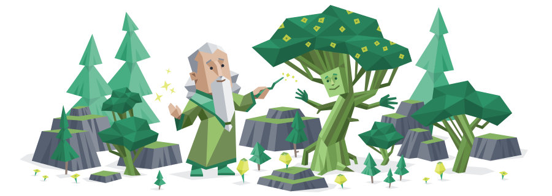

### Hi there, I'm sl0th  

🏫 I'm a senior student from 🇨🇳.

🌱 I’m currently learning fuzzing & [V8](https://github.com/v8/v8) | [CodeQL](https://github.com/github/codeql) | Static Analysis.

🤩 I'm interested in Web Security and Java Security.

📫 Contact me via z694081360@gmail.com

📃 My blog: https://sl0th.top/

🎭 MBTI: INFJ

 

<!--
**sloth31/sloth31** is a ✨ _special_ ✨ repository because its `README.md` (this file) appears on your GitHub profile.

Here are some ideas to get you started:

- 🔭 I’m currently working on ...
- 🌱 I’m currently learning ...
- 👯 I’m looking to collaborate on ...
- 🤔 I’m looking for help with ...
- 💬 Ask me about ...
- 📫 How to reach me: ...
- 😄 Pronouns: ...
- ⚡ Fun fact: ...
-->

